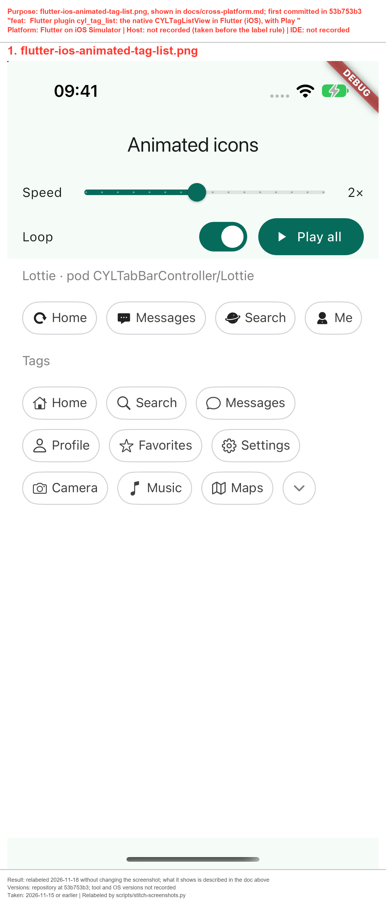
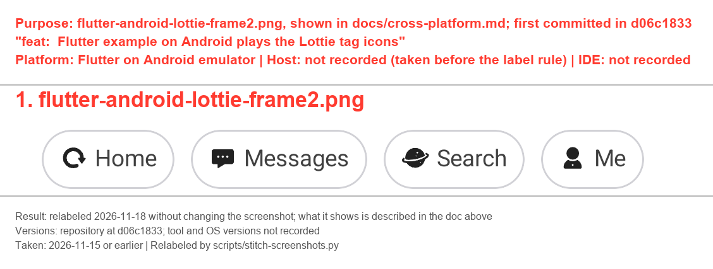
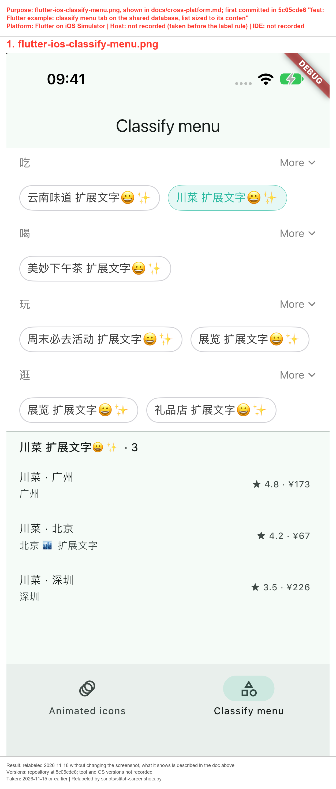
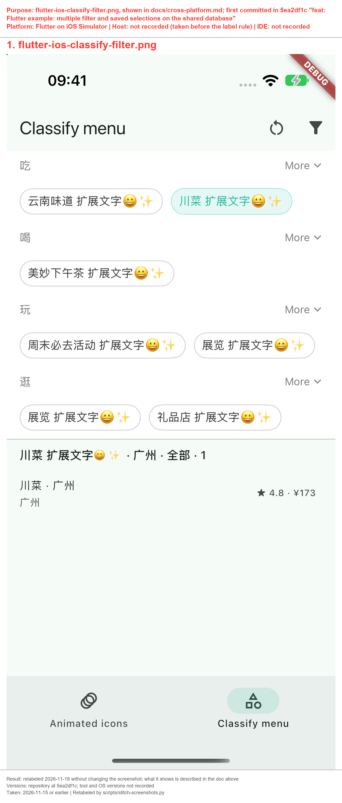
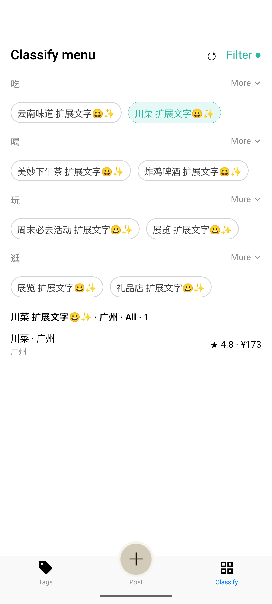
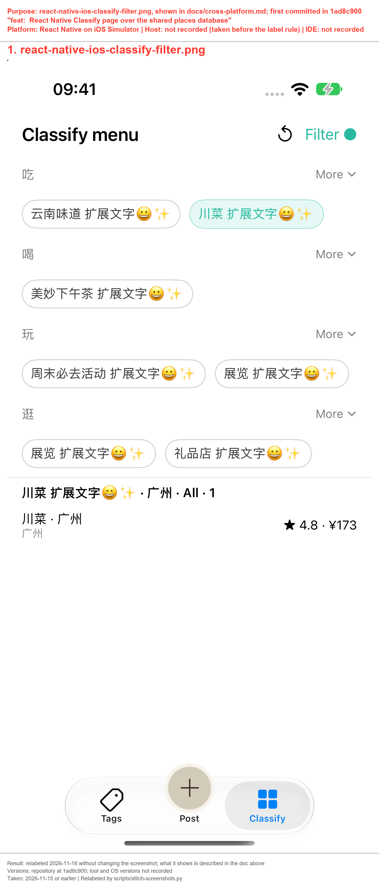
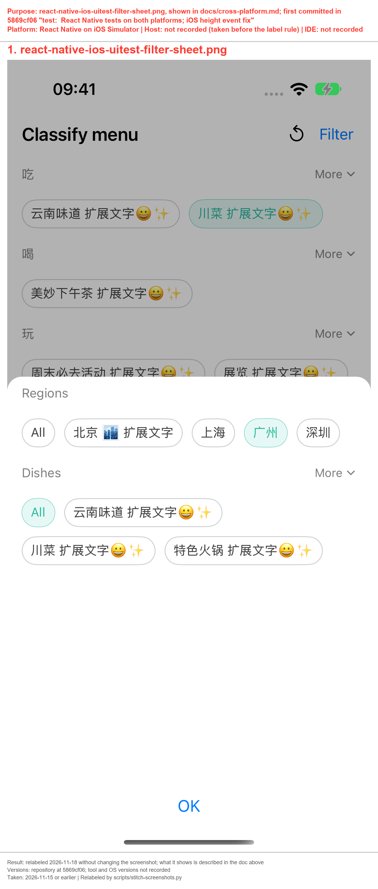
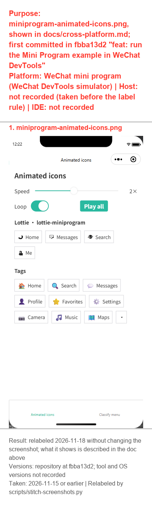

# Cross-platform consistency

The examples of this project on every platform (iOS, Android, and later React Native, Flutter, HarmonyOS, Mini
Program) show the same screens with the same data and look the same as iOS, which is the reference.

## DONE (2026-11-15): one shared local database for every platform

- **Status:** iOS demo app, `Example/CYLMenuExample` and Android DONE (2026-11-12). Flutter DONE (2026-11-15: the asset
  `cyl_places.sqlite`, through sqflite) and React Native DONE (2026-11-15: the app bundle / `assets/custom`, through op-sqlite).
  Both run the iOS statement, sections below. Every platform lists 1 place for 川菜 + 广州.
- **The database:** `Example-Shared/Database/cyl_places.sqlite` (table `places`: id, name, category, tag, region,
  rating, price; 83 rows), made from `data.json` by `scripts/generate-places-db.py`; `--check` fails when the
  committed file no longer matches the data. Every platform opens this one file read-only and builds the same SQL
  (`tag = ?`, `region IN (…)`, `tag IN (…)`, `ORDER BY rating DESC, id`):
  - iOS demo app: bundled through a project reference (`SOURCE_ROOT/Example-Shared/Database`), read with SQLite3
    (`CYLDemoPlaces` in `CYLFilterDemoViewController.swift`); the Filter tab shows the conditions, the SQL and the count.
  - Android example: `Example-Shared/Database` is an asset folder (`example/build.gradle.kts`); `ClassifyPlacesDatabase`
    copies the asset to the app's databases folder when it differs and opens it read-only.
  - The file also holds the menu example's reviews (tables `reviews`, `review_keywords`, the 10 reviews of
    `CYLReviewStore.mockReviews()` in the same order and schema): the Android Menu tab reads them, and its database
    mode runs the iOS example's SQL on them (2026-11-12).
  - `Example/CYLMenuExample` (DONE 2026-11-14): the file is a bundle resource (project reference
    `Example-Shared/Database/cyl_places.sqlite`); `CYLExampleDatabase` attaches it and copies its `reviews`,
    `review_keywords` and `places` rows into its own writable database (which also holds the saved selections), instead
    of filling the tables at run time. Test: `testExampleDatabaseHoldsTheDemoData` (83 places, first 日式拉面 · 北京, 93;
    the reviews in `CYLReviewStore` order); the example suite, 80 tests, 0 failures.
- **Evidence:** both show `SELECT name, category, tag, region, rating, price FROM places ORDER BY rating DESC, id` →
  83 of 83, first 日式拉面 · 北京 ★5.0 ¥93 (`assets/ios-demo-filter-tab.png`, `assets/android-filter-results.png`);
  `scripts/unit-tests.sh menu` 30 tests, 0 failures (the Filter test reads the bundled file).
- **Context:** the Android Classify / Filter tabs query a SQLite `places` table made on the device; the iOS demo app
  filters the same places in memory, and `Example/CYLMenuExample` builds its own SQLite database at run time.
- **Requirements:**
  1. iOS uses the Android implementation's approach: the conditions build an SQL query on a local SQLite database,
     and the page shows the conditions, the SQL statement, the count and the rows.
  2. iOS and Android share **one** local database file (the same file in the repository, bundled by each app), so
     the demos show the same data.
  3. Every other platform uses the same database file too, including React Native and Flutter.
- **Prompt (verbatim):**

  > 这个android实现，同步到iOS端实现，共用share 同一个本地数据库 ，保持演示的一致性。相同要求，其他平台也使用同一个数据库。包括RN flutter。将该要求写进跨端相关文档，标注TODO continue

## DONE (2026-11-15): the tag cells look the same as iOS on every platform

- **Status:** Android left spacing DONE; the iOS icon-to-title gap fixed 2026-11-14; the remaining 6 pt width difference is
  font metrics (inherent). Flutter and React Native host the native list (Swift on iOS, Kotlin on Android), so their cells
  are the native cells; their screenshots below match each platform's native example.
- **Cause (core):** Android `CYLIndexPathButton` put the image as a compound drawable at the padding edge and
  centered only the text, so the image touched the cell's left edge. iOS `UIButton` centers image and title together,
  then `CYLIndexPathButton -layoutSubviews` moves the image `cyl_imageTitleSpacing / 2` left and the title the same
  right (plus `cyl_titleLeadingInset`). The Android button now computes its padding with the same algorithm (centered
  or start gravity, half spacing, title inset), and the section header's title button starts at 16 with the inset
  between icon and title, as `CYLFilterHeaderView` does on iOS.
- **Pixel comparison** (iOS 27.2 simulator, iPhone 17 Pro, @3x → pt; Android 15 emulator, 2.625x → dp; same data,
  same parameters; `tools`: a CoreGraphics scanner measuring the pill and its content edges):

  | Cell | Platform | Pill | Left padding | Right padding |
  | --- | --- | --- | --- | --- |
  | ★ 展览 扩展文字😀✨ | iOS | 16.0…199.7 (183.7) | 6.0 | 8.7 |
  | ★ 展览 扩展文字😀✨ | Android before | 16.0…193.5 | 0 (image at the edge) | 9.9 |
  | ★ 展览 扩展文字😀✨ | Android after | 16.0…193.5 (177.5) | 8.8 | 9.9 |
  | 美妙下午茶 扩展文字😀✨ | iOS | 16.0…228.7 (212.7) | 10.3 | 12.3 |
  | 美妙下午茶 扩展文字😀✨ | Android after | 16.0…222.5 (206.5) | 10.7 | 10.7 |

  Top to bottom: iOS, Android before, Android after:

  

- **Residual (analyzed below):** iOS cells are about 6 pt wider and the iOS gap between image and title is about 10 pt against
  4.6 dp, although both use text width + 38 and a spacing of 5. Both come from text measurement: the iOS title label
  is wider than `-sizeWithAttributes:` (Apple Color Emoji / PingFang metrics), and `UIButton` centers within that
  label; Android measures with Noto. Next: log the iOS title label's frame in a test, then decide whether the core
  should size cells from the label's intrinsic width on both platforms.
  Update 2026-11-14 (measured, iOS 27.0 simulator, @3x): the core's formula is the same on both platforms
  (`CYLClassifyMenuViewController.cellWidth(for:)`: `ceil(text width) + 38` with an image, `+ 19` without; Android's
  `itemWidth()` in `CYLClassifyMenu.kt` is the same), so the 6 pt width difference comes only from the two text
  measurements (Apple Color Emoji and PingFang against Noto): a font-metric difference, not a layout bug.
  The gap between the icon and the title was a real iOS bug, now fixed: in the cell `云南味道 扩展文字😀✨` (216 pt) the
  image view was at x = 6 and the title label at x = 32, so the gap was 10 pt instead of `imageTitleSpacing` (5 pt) and
  the side padding 6 pt; `CYLIndexPathButton` moved the frames by half the spacing after `layoutSubviews()`, and UIButton
  keeps those frames between passes, so the move was applied again on every pass. It now overrides
  `imageRect(forContentRect:)` and `titleRect(forContentRect:)`, which UIButton asks for on every pass. Measured after
  the fix: image x = 8.5, title x = 29.5, gap 5.0, padding 8.5 on both sides, equal to Android's 4.6 dp gap and 8.8 / 9.9
  paddings within the font difference. Regression test: `CYLExampleDatabaseTests.testPortedClassifyMenuDemoQueriesTheDatabase`
  (gap 5, centered; it fails before the fix). A button on its own in a test window did not reproduce the accumulation, so
  the ObjC test `testButtonsPlaceImageAndTitleWithoutDeprecatedInsets` only checks that frames repeat.
  Left: the width difference is inherent to the platforms' fonts; React Native and Flutter have no example here yet.
- **Context:** with the same parameters, the Android classify menu's tag cells differ from iOS: an image sits at the
  cell's left edge on Android, while iOS centers image and title together, so the left padding equals the right one
  (`assets/request-android-cell-left-spacing.png`, `assets/request-ios-cell-reference.png`,
  `assets/request-android-cell-compare.png`).
- **Requirements:**
  1. Compare the iOS and Android tag cells pixel by pixel, the left spacing above all.
  2. Look for the cause in the core (library) first, comparing the two implementations: with the same parameters
     they must look the same.
  3. Every other platform matches iOS too, including React Native and Flutter.
- **Prompts (verbatim):**

  > 该example中 tag cell 左侧间距有问题。优先从core层面找原因修复。因为右侧间距正确。continue

  > 你刚刚实现的android中 该example中 tag cell 左侧间距有问题。优先从core层面找原因修复。因为右侧间距正确。continue

  > 像素级对比iOS与Android端 tag cell实现UI差别。尤其注意左侧间距，android端异常。优先从core层面对比两者实现差别，因为初始化参数都是一样的情况下，显示也应保持一致。同样要求其他端与iOS端保持一致，包括RN flutter。写入跨端相关文档，标记todo。

## DONE for iOS and Android (2026-11-15): the Flutter example

- **Status:** the Flutter plugin `flutter/cyl_tag_list` wraps the native `CYLTagListView` (Swift on iOS, Kotlin on
  Android); both pass the same integration test.
  React Native follows once the Flutter version passes on both platforms (the order of `android.md`, HarmonyOS TODO).
- **Design:** the same approach as CYLTabBarController's Flutter component: Flutter does not redraw the tag list, a platform
  view hosts the native one, built from the configuration dictionary the core already accepts (`CYLTagListView(configuration:)`;
  a value `asset:<key>` becomes the file path of a Flutter asset). A method channel per view carries the playback controls
  (`playAll`, `setSpeed`, `setLoops`), `applyConfiguration` and `state`; taps come back as `onTap`. The playback controls of
  `example-demo-rules.md` are Dart widgets (a `Slider` from 0.25x to 4x, a `Switch`, a Play all button).
- **iOS evidence** (iPhone 17 Pro simulator, iOS 27.0, Xcode 27.2, Flutter 3.47.9, CYLTabBarController `53766de`, 2026-11-15
  00:3x NZDT): `flutter analyze` has no issues; `integration_test/tag_list_test.dart` passes (the native list holds the 14
  tags, the slider sets the native speed in steps of 0.25, the Loop switch sets the native flag and Play all is accepted);
  with `--dart-define=CYL_AUTOPLAY=true` (2x, loop, Play all) two screenshots 0.35 s apart differ only in the Lottie row
  (pixels x 85…1039, y 813…853 of 1206 × 2622), so the animations play inside Flutter:

  

- **Android evidence** (Android 15 / API 35 emulator `CYL_API35_test`, Flutter 3.47.9, JDK 17, 2026-11-15 00:55 NZDT): the
  plugin's Kotlin platform view builds `CYLTagListView.tagListViewWithConfiguration` (the library is the Maven artifact
  `com.cyl:classifymenu:0.1.0`, published by `android/scripts/gradle.sh merged :library:publishReleasePublicationToBuildRepository`;
  `asset:` values become `file:///android_asset/flutter_assets/…`); the integration test passes; release APK screenshot:

  

  SF Symbol tags: DONE (2026-11-15 00:58): Android has no SF Symbols, so the example ships stand-in vector drawables
  `cyl_system_<name>` (`example/android/app/src/main/res/drawable`) and keeps them through release resource shrinking
  (`res/raw/cyl_keep.xml`, because the library looks them up by name). Lottie row: DONE (2026-11-15 07:23, emulator `CYL_API35_arm64`,
  release APK): the example links CYLTabBarController's Android engine (`cyltabbar-release.aar` and `tabpages-*.jar`
  of `Example-Android` at the commit of `android/merged/gradle.properties`, built through the merged build; folder set
  by `cyl.tabbar.libs`) with Lottie 6.6.2, and keeps the classes the library finds by reflection through R8
  (`example/android/app/proguard-rules.pro`). Two frames 0.35 s apart after Play all (the Home icon is animating):

  
  
  Fold: DONE, not a bug (2026-11-15): the section folds only when it needs more than `defaultVisibleRows` (3) rows
  (`CYLTagListView.kt`, `canFoldRowCount`); on the 1080 px wide emulator the ten tags fit in exactly 3 rows (screenshot
  above), so there is no tail control, while the wider iOS tags need a fourth row and fold. A debug APK launched without `flutter run` stays on the
  splash screen; the release APK runs.
- **Limits and next steps (TODO):** (1) the Android differences above; (2) DONE 2026-11-15: the classify menu tab and the multiple filter (see below; formerly: the
  animated icons), not yet the classify menu and the multiple filter in tabs of their own; (3) the shared database
  (`cyl_places.sqlite`) is not used by this example yet; (4) Swift Package Manager is not supported (the plugin needs the
  pod); (5) the Dart tests only run on the iOS simulator.

## DONE (2026-11-15): the Flutter example's classify menu on the shared database

- **Context:** the Flutter example (`flutter/cyl_tag_list/example`) has one screen (Animated icons). The iOS and
  Android examples also have the menu linkage screen: a classify menu (single choice, the tags of `places`, folded per
  category) whose selection filters the places of `Example-Shared/Database/cyl_places.sqlite`, shown below it.
- **Requirements:** a second tab "Classify menu" in the Flutter example, reading the same bundled `cyl_places.sqlite`
  (sqflite), sections = the categories 吃喝玩逛, single selection, tapping a tag lists its places (name, region, rating);
  a test and screenshots on iOS and Android.
- **Prompt (verbatim):** "根据Memory 以及本地Memory文档，尝试继续完成对于 CollectionViewClassifyMenu文件夹 我们未结束的任务，然后遍历所有文档，找到关键词TODO 完成所有TODO工作。重点查看CollectionViewClassifyMenu文件夹相关文档的TODO" (EN: continue the unfinished work of this folder from memory, find
  every TODO in the documents and finish it, focusing on this folder), followed by "continue".
- **Result:** a second bottom tab "Classify menu" (`example/lib/classify_menu_page.dart`): sqflite opens the bundled copy
  of `cyl_places.sqlite` (`example/assets/`, the same file as `Example-Shared/Database/`), one section per category
  (吃喝玩逛, tags in database order, folded to one row with a More control), single choice; the selected tag lists its
  places (rating first), tapping it again lists all 83. The plugin gained `onContentHeightChanged` / `sizesToContent`
  and `CylTagListController.contentHeight()`: both platforms send `heightThatFitsWidth` when the view's width changes
  and when the list folds or unfolds (iOS through a container view, because key-value observing of bounds does not
  see Flutter's frame changes), and the page sizes the list to it, at most half the page.
- **Tests:** `integration_test/classify_menu_test.dart` (83 places, categories 吃喝玩逛, a tag filters) and
  `tag_list_test.dart` pass on the iPhone 17 Pro simulator (iOS 27.0) and the Android 15 emulator (API 35).
- **Screenshots** (Flutter 3.47.9, after commit `bd270bb`, 2026-11-15; 川菜 selected, iOS via
  `--dart-define=CYL_TAB=1 --dart-define=CYL_SELECT=0-1`, Android tapped by accessibility bounds with 逛 expanded):

  
  

- **Multiple filter and saved selections: DONE (2026-11-15).** The filter button opens a sheet with a native
  multiple-choice list (地区过滤: 全部 + the four regions; 菜品过滤: 全部 + every tag; 全部 exclusive) and 确定; the
  regions and dishes are ANDed with the tag in the iOS example's statement (`tag = ? AND region IN (…) AND tag IN (…)`).
  Both selections are saved in a `selections` table of the app's copy of the database (scenarios `menu.classify` and
  `menu.filter`, as on iOS) and restored at launch; ↺ (重置筛选条件) clears them; no match shows
  "没有符合条件的地点，换个条件试试". The plugin gained `onSelectionChanged` (every selected tag, from
  `menu(_:didChangeSelectedItems:)` / `menuDidChangeSelectedItems`). Tests: `classify_menu_test.dart` (statement,
  saved selections, filter sheet) and `tag_list_test.dart` pass on iOS 27.0 and Android 15.
  Screenshots (after commit `5c05cde`, 2026-11-15 08:03): Android, the sheet with 上海 picked (tapped by accessibility
  bounds), and 川菜 · 广州 after relaunch (restored) and refiltering; iOS 27.0 with
  `--dart-define=CYL_TAB=1 --dart-define=CYL_SELECT=0-1 --dart-define=CYL_FILTER=0-3,1-0`:

  
  
  

## DONE (2026-11-15): the React Native example

- **Context:** the Flutter example passes on iOS and Android (above), so React Native is next (the order of this document).
- **Requirements:** a React Native component `react-native/react-native-cyl-tag-list` (Fabric native view) that hosts the native
  `CYLTagListView` (Swift on iOS, Kotlin `com.cyl:classifymenu` on Android), built from the same configuration dictionary as the
  Flutter plugin; playback controls (Play all, speed slider, loop switch, `example-demo-rules.md`); `onTap`, `onSelectionChanged`,
  `onContentHeightChanged`; an example app with the same screens as Flutter (animated tag list, classify menu with the multiple
  filter over the shared `cyl_places.sqlite`, saved selections); tests and labeled screenshots on the iOS 27.0 simulator and the
  Android 15 emulator; the same layout as iOS (left spacing, section above).
- **Steps:** 1. scaffold the library and the example (create-react-native-library, the layout of CYLTabBarController's
  `react-native-cyltabbar`); 2. iOS view; 3. Android view; 4. the classify menu screen; 5. tests and screenshots.
- **Prompt (verbatim):**

  > 根据Memory 以及本地Memory文档，尝试继续完成对于 CollectionViewClassifyMenu文件夹 我们未结束的任务，然后遍历所有文档，找到关键词TODO 完成所有TODO工作。重点查看CollectionViewClassifyMenu文件夹相关文档的TODO

  English: continue the unfinished tasks of the CollectionViewClassifyMenu folder from memory and the local notes, then find
  every TODO in the documents and finish it, the documents of this folder first. Then: "continue".
- **Step 1–2 DONE (2026-11-15, iOS):** `react-native/react-native-cyl-tag-list` (create-react-native-library 0.64, Fabric
  view, React Native 0.88.0). The JS view takes the configuration object (sent as JSON), `animationSpeed` (0 = each
  animation's own), `animationLoops`, the `playAll` command (`ref.playAll()`), and reports `onTagTap`,
  `onSelectionChange` and `onContentHeightChange`. On iOS a Swift view `CylTagListBridge` owns the core's
  `CYLTagListView` (its delegate is a private object, so the generated Objective-C header does not import the core) and
  `CylTagListView.mm` forwards props, events and the command. `asset:<name>` is a file of the app bundle (the example
  bundles CYLTabBarController's four Lottie tab icons). Codegen of React Native 0.88 rejects arrays of objects in events
  ("Unable to determine event type"), so the selection travels as `itemsJSON`. Build: `USE_FRAMEWORKS=static pod install`,
  Release, in the mirror `/tmp/xpr/rn` (exFAT). Evidence (iPhone 17 Pro simulator, iOS 27.0, Xcode 27.2, React Native
  0.88.0, base commit `7e3e696`, 2026-11-15): the list sizes itself to its content (Lottie row, ten SF Symbol tags, tail fold):

  

  Still TODO: step 3 (the Android view, Kotlin `com.cyl:classifymenu`), step 4 (the classify menu screen over
  `cyl_places.sqlite`), step 5 (tests on both platforms; a real slider instead of the speed steps).

### DONE for iOS (2026-11-15): the React Native example inside CYLTabBarController's React Native component

- **Requirement:** the example app's shell is CYLTabBarController's own React Native component
  (`react-native-cyltabbar`, `CrossPlatform/` of its newest commit), not a plain React Native screen: the tag list demo
  and (later) the classify menu are its tab pages, as the iOS and Flutter examples use CYLTabBarController.
- **Prompt (verbatim):**

  > RN的example 层也应使用 CYLTabBarController 的RN组件 作为Example层展示使用

  English: the React Native example layer should also use CYLTabBarController's React Native component as its shell.
- **Result (iOS):** the example's shell is `CYLTabBar` of `react-native-cyltabbar`: tabs Tags (the tag list demo) and
  Classify (placeholder until step 4), and the raised Post plus button with a page of its own (`pageIdentifier`,
  `centerYOffset: -14`, CYLTabBarController's `post_normal` / `post_highlight` images). The component is not on npm, so
  `react-native/react-native-cyl-tag-list/scripts/fetch-cyltabbar.sh` checks out CYLTabBarController at the pinned commit
  into `.deps/` (git-ignored); `example/package.json` links it and `metro.config.js` resolves it to its `src/index.tsx`.
  The pod pin in `example/ios/Podfile` is the same commit.
- **Fix in CYLTabBarController** ([`460ed89f`](https://github.com/ChenYilong/CYLTabBarController/commit/460ed89f192db37d5b347cf72b5ee63ecdc11854),
  `feat/cross-platform-components`): every Objective-C++ file that imported both its Objective-C headers and
  `CYLTabBarController-Swift.h` failed to compile. The Swift header declares the `@_cdecl` functions `noexcept` and with plain
  `NSArray` / `NSDictionary` parameters (14 functions, such as `CYLLocalizedString` and `CYLBadgeAccessibilityDescription`).
  The fix adds `CYL_NOEXCEPT` to those declarations and drops the lightweight generics of three animation-file functions.
  React Native's `.mm` files include both headers, so `react-native-cyltabbar` could not build at `c7f59bc` or `53766de`.
  Defining `SWIFT_NOEXCEPT` empty in the Podfile does not help, because the generated header defines it without checking
  whether it is already defined.
- **Evidence** (iPhone 17 Pro simulator, iOS 27.0, Xcode 27.2, React Native 0.88.0, CYLTabBarController `460ed89f`,
  2026-11-15): Release build, first launch:

  

  Still TODO: Android (both components), tap checks of Post / Classify, and tests.
- **Step 3 DONE (2026-11-15, Android):** the Kotlin Fabric view `CylTagListView` (`android/src/main/java/com/cyltaglist`)
  is a `FrameLayout` around the Kotlin `CYLTagListView` (`com.cyl:classifymenu:0.1.0`, the Maven folder of
  `cyl.classifymenu.repo`). It lays out the native list itself, because React Native lays out only its own views, and it sends
  the same events as iOS. `asset:<name>` is `file:///android_asset/<name>`. In the example, `react-native-cyltabbar` compiles
  CYLTabBarController's Kotlin sources from the `.deps` checkout (`cylAndroidRoot` in `example/android/build.gradle`), with
  Lottie 6.6.2. The tab icons are vector drawables `cyl_tab_tag` / `cyl_tab_classify`, because Android has no SF Symbols and the
  tab bar maps `system:tag` to a drawable named `tag`. Evidence (Android 15 / API 35 emulator `CYL_API35_arm64`, React Native
  0.88.0, release APK, base commit `1b54d42`, CYLTabBarController `460ed89f`, 2026-11-15). Taps by adb, top to bottom:
  1. first launch;
  2. 2x speed, Loop on, Home tapped (the selection event reached JavaScript: "Selected: Home");
  3. the Post page:

  
  
  

  Still TODO: step 4 (the Classify page over `cyl_places.sqlite`), step 5 (automated tests; iOS taps need a tap tool).
- **Step 4 DONE (2026-11-15): the Classify page** (`example/src/ClassifyPage.tsx`, `PlacesDatabase.ts`), ported from the
  Flutter page:
  - **Data:** the shared `cyl_places.sqlite` through `@op-engineering/op-sqlite` 19.0.5. It is copied once from the app bundle
    (iOS) or `assets/custom` (Android).
  - **Menu:** one section per category, single choice, folded to one row.
  - **Filter sheet:** regions and dishes, each led by an exclusive 全部, then 确定. The same SQL as iOS (`tag = ? AND region IN (…) AND tag IN (…)`,
    ordered by rating DESC, id).
  - **Saving:** the `selections` table saves both selections (`menu.classify`, `menu.filter`), and ↺ resets them.
  - **Page:** a summary line and an empty state.
  - **Launch arguments (iOS):** `-CYLTab 1 -CYLSelect 0-1 -CYLFilter 0-3,1-0` for screenshots without taps.
  - **Two fixes:**
    - **Android filter sheet:** the list in the sheet was blank, with its cells at 0 × 0. The list sets its content width
      during a layout pass and asks to be measured again; the request stopped at the Fabric view, and `measure()` skips a
      view without the flag. `CylTagListView.kt` now marks the subtree with `forceLayout()` before each of up to three
      measure and layout passes, which also run when the size changes.
    - **Filter glyph:** the funnel glyph is missing from Android's fonts, so the filter button is the word Filter
      (with ● while filtering).
  - **Evidence** (Android 15 / API 35 emulator `CYL_API35_arm64`, release APK; iPhone 17 Pro simulator, iOS 27.0, Xcode 27.2;
    React Native 0.88.0; base commit `59c55cd`; 2026-11-15). Taps by adb on Android, top to bottom:
    1. every place (83);
    2. 川菜 tapped, then the filter sheet with 广州;
    3. after 确定 and a force-stop, the app relaunched with 川菜 · 广州 restored (1 place, as on iOS and Flutter);
    4. iOS with the same conditions from launch arguments:

  
  
  
  

  Still TODO: step 5 (automated tests on both platforms; iOS taps need a tap tool).
- **Step 5 DONE (2026-11-15): tests.** Commands (in `react-native/react-native-cyl-tag-list`):
  - **Jest, `yarn jest`:** the wrapper (configuration sent as JSON, playback props, the three events unwrapped, `playAll` on
    the native view); 3 tests pass.
  - **Jest, `cd example && yarn jest`:** `placesQuery` is the iOS example's statement with bound values; 3 tests pass.
  - **Android end to end, `scripts/e2e-android.sh [serial] [apk]`:** uiautomator finds the elements by text or accessibility
    label, never by coordinates. It checks 2x, a tag tap reaching JavaScript, 83 places, 川菜 (3), 川菜 + 广州 (1), the
    conditions restored after a force-stop, and reset (83). PASS on the Android 15 / API 35 emulator `CYL_API35_arm64`;
    shellcheck is clean.
  - **iOS UI test, `xcodebuild test -workspace example/ios/CylTagListExample.xcworkspace -scheme CylTagListExample -only-testing:CylTagListExampleUITests`:**
    the new `CylTagListExampleUITests` target. It finds the tags by the core's identifier `CYLTagListItem` and the tab bar
    and page buttons by label, and runs the same flow through a relaunch. TEST SUCCEEDED on the iPhone 17 Pro simulator,
    iOS 27.0, Xcode 27.2, in 36 s.
  - **Bug the iOS test found:** reaching the Classify tab by a tap left its menu 1 pt tall, so its tags were hidden (the
    screenshots above came from launch arguments and did not show it). Probable cause: the first layout sent the height
    event before Fabric gave the view its event emitter, so the event was lost, and the view had already recorded the height
    as sent. Fix: `CylTagListView.mm` overrides `updateEventEmitter:` and sends the height again
    (`CylTagListBridge.resendContentHeight()`).
  - **Evidence** (base commit `a30e086`, React Native 0.88.0, 2026-11-15). The iOS UI test's filter sheet, then the Android end-to-end
    result:

  
  

- **Result:** the React Native example covers the same screens as iOS, Android and Flutter, on both platforms:
  - the animated tag list with Play all, speed and loop;
  - the classify menu with the multiple filter over the shared database;
  - the saved selections;
  - all inside CYLTabBarController's React Native tab bar.

  Not covered: a physical device; Detox or another end-to-end framework (the two scripts above stand in for one).

## DONE (2026-11-15): every CYLTabBarController pin at its newest commit `117be52c`

- **Why:** AGENTS.md pins CYLTabBarController by its newest commit everywhere. `117be52c` fixes its framework build
  (issue-progress.md).
- **Moved:**
  - the React Native example (`example/ios/Podfile`, `scripts/fetch-cyltabbar.sh`) from `460ed89f`;
  - the Flutter example (`example/ios/Podfile`) from `53766de`;
  - the Android merged build (`android/merged/gradle.properties`, which also feeds the engine `.aar` of the Flutter and
    React Native Android examples) from `4639a0c`.
- **Lint fix:** the merged example's release build failed in lint, because lifecycle's `NonNullableMutableLiveDataDetector`
  crashes this Android Gradle Plugin's lint with `IncompatibleClassChangeError`. It fails the same way at the old pin, so
  the crash was already there. `android/merged/example/build.gradle.kts` disables that one check
  (`NullSafeMutableLiveData`).
- **Evidence** (iPhone 17 Pro simulator, iOS 27.0; Android 15 / API 35 emulator `CYL_API35_arm64`; 2026-11-15):

  | Example | Check | Result |
  |---|---|---|
  | React Native, iOS | UI test | passed (33 s) |
  | React Native, Android | `scripts/e2e-android.sh` | PASS |
  | Flutter, iOS | `flutter test integration_test` | All tests passed (2) |
  | Flutter, Android | `flutter test integration_test`, with the engine rebuilt at `117be52c` | All tests passed (2) |
  | Android merged | `:library:testDebugUnitTest` | 78 tests, 0 failures |
  | Android merged | `:example:assembleRelease`, lint included | BUILD SUCCESSFUL |
## TODO (2026-11-15): the WeChat Mini Program example

- **Context:** the Mini Program is the next platform of this document (iOS, Android, React Native, Flutter, HarmonyOS,
  Mini Program). The repository had no Mini Program code; the documents mention it only as a platform of the rules
  (`example-demo-rules.md`: playback controls; `instructions.md`: screenshots labeled with the platform; the
  `cyl-upstream` / `cyl-verify` skills).
- **Location:** `CrossPlatform/wechat-miniprogram` (new `CrossPlatform/` folder, the layout of CYLTabBarController's
  `CrossPlatform/`; Flutter and React Native keep their top-level folders).
- **Design:** a Mini Program cannot host the native view, so the component `cyl-tag-list` ports the core's
  `CYLTagListView` from the same configuration dictionary (selection rules of `handleTap(at:)`, exclusive items,
  `defaultVisibleRows` folding measured from the rendered cells, 更多 / 收起). A Mini Program has no SQLite, so
  `scripts/export-miniprogram-data.py` exports the rows of the shared `cyl_places.sqlite` to a module (`--check` keeps
  it in step) and `utils/places-db.js` runs the iOS example's statement on them. Lottie icons play through
  `lottie-miniprogram` with speed, loop and Play all. Details: `CrossPlatform/wechat-miniprogram/README.md`.
- **Step 1 DONE (2026-11-15):** the project (two bottom tabs: Animated icons with the playback controls, Classify menu
  with the multiple filter and saved selections), the component and the data export; `npm test` (node --test) passes
  17 tests: the 83 places in database order, 吃喝玩逛, the statement and its placeholders, best rated first
  (日式拉面 · 北京 ★5.0 ¥93, as on iOS and Android), the selection rules, folding, the saved selections.
- **Step 2 DONE (2026-11-15): runs in WeChat DevTools.** Driven by the `wechatide` CLI (skill 0.3.11, DevTools
  2.02.2609250, base library 3.18.0, simulator iPhone, Windows 11): `project_import`, `open_project_window`,
  `build_npm` (lottie-miniprogram, no warnings), `simulator_open_page`, `automation_*`, `simulator_screenshot`.
  DevTools rejects `touristappid` (`APPID_ERROR`), so the AppID is set locally in the git-ignored
  `project.private.config.json`. Checked on the running app:
  - Animated icons: the four Lottie icons render; with `?autoplay=1` (2×, Loop on, Play all) two screenshots differ
    only inside the Lottie rows (x 25…227, y 265…321 of 363 × 785), so the animations play; the Tags section folds at
    3 rows with the tail control.
  - Classify menu: 吃喝玩逛 folded to one row each (更多 ▾); the filter button (a real tap) opens the sheet
    (地区过滤 / 菜品过滤, 全部 selected); 广州 + 确定 (a real tap) gives `… WHERE tag = ? AND region IN (?) …` and
    川菜 · 广州 ★4.8 ¥173, 1 place, as in the Flutter example; after `reLaunch` without a query both selections come
    back (`0-1`, `1-0,0-3`); ↺ (a real tap) resets to 全部 · 83.
  - Limit of the automation, not of the component: `automation_element_action` cannot reach elements inside a custom
    component (`#filterList >>> .cyl-item` resolves to the host), so the 广州 tap called the component's tap handler
    through `automation_evaluate`; the console has no errors (only lottie-miniprogram's own warnings: a deprecated
    `wx.getSystemInfoSync`, dynamic canvas creation).
  - The launch query of `wechatide simulator_open_page` passes through `wechatide.cmd`, so on Windows escape `&` as
    `^&`; the page decodes URL-encoded values.

  
  
  

- **Still TODO:** (1) DONE above; a real-device preview (`auto_preview`) is not done yet; (2) the tag cells against iOS: DONE (below); (3) a real AppID for phone preview (the project uses
  `touristappid`); (4) the shell: DONE (below).
- **Tag cells measured against the core (2026-11-15).** The port now takes the core's defaults and keys
  (`CYLMenuStyle` / `CYLTagAppearance`: `tagContentInsets` {5, 10, 5, 10} with the border inside, `imageTitleSpacing` 4,
  `imageSize` 14, `itemHeight` 30, `interitemSpacing` / `lineSpacing` 10, `sectionInsets` {10, 16, 10, 16} per section,
  `headerHeight` 36 with a 14 pt regular title; before: 8 px padding plus the border, spacing 5, bold 15 px headers).
  Measured in WeChat DevTools from the component's own layout pass (`cellMetrics()`, iPhone simulator, base library 3.18.0):
  - every Classify tag (31): title 10.00 px from both edges, width = title width + 20, as
    `CYLTagButton.width(forTitle:iconSize:style:)` (content + left and right insets); the core rounds the title width up
    (`ceil`) and CSS does not, so a Mini Program tag can be up to 1 px narrower (text measurement, as between iOS and Android);
  - every tag with an icon (14, Lottie and stand-in): title 32.00 px from the left (10 + 18 icon + 4) and 10.00 px from
    the right: icon and title centered together with the left padding equal to the right one, the iOS layout of
    `CYLIndexPathButton` (section "the tag cells look the same as iOS"). The emoji stand-ins first measured 38.72 px, because
    an emoji at an 18 px font is about 24.7 px wide; they now sit in the 18 × 18 icon slot.
  A pixel comparison with an iOS screenshot needs a Mac (not available on this machine).

- **Shell DONE (2026-11-15): CYLTabBarController's Mini Program tab bar.** The example's shell is `cyl-tab-bar` of
  CYLTabBarController's `cyl-tabbar-miniprogram` (`CrossPlatform/wechat-miniprogram-cyltabbar`, pinned at `117be52c` (first `460ed89f`; the Mini Program packages are the same at both), the
  React Native example's pin), as the iOS, Flutter and React Native examples use CYLTabBarController: a custom tab bar
  (`app.json` `"custom": true`, `miniprogram/custom-tab-bar/`) with the tabs Tags and Classify and the raised Post button
  with a page of its own between them (`CYLPlusButtonCenterYOffset` -14, the React Native example's `post_normal` /
  `post_highlight` images; drawn PNG tab icons, as a Mini Program has no SF Symbols). The package is not on npm, so
  `node scripts/fetch-cyltabbar.js` checks CYLTabBarController out into `.deps/` (sparse, git-ignored) and copies its `src/`
  to `miniprogram/cyl_components/` (git-ignored; outside `miniprogram_npm`, which Build npm rewrites); `--check` keeps it
  at the pin, and CI runs both. The filter sheet hides the bar while it is open (`cyl_setTabBarHidden`), which otherwise
  covered 确定. The example uses CYLTabBarController's AppID `wx5e29c9d33906f074` (技术清谈), set in the git-ignored
  `project.private.config.json`. Test: `tab-bar-configuration.test.js` reads the example's configuration through
  CYLTabBarController's own reader (Tags, Classify, the Post button with a page); `npm test`: 21 tests pass. In WeChat
  DevTools: `switchTab` to each page selects its tab (`selectedIdentifier` tags / classify / post), the tab bar's
  `select` event switches pages, the sheet opens and confirms with real taps and no console errors.

  
  
  

- **Prompt (verbatim):**

  > 修复 Class 文件夹下资源文件名太长 导致 git 相关操作失败的问题。 资源文件 关键词搜 leftBarButton continue
  > 。基于新分支 开始下微信小程序开发。找到docs里面任何提及微信小程序的信息开始开发。找到crossplatorm 相关文件夹，没有就新建，新建或者更微信小程序开发。微信小程序开发者工具Skills ，根据文档

  English: fix the git failures caused by the over-long resource file names under `Class` (search "leftBarButton");
  then, on the new branch, start the WeChat Mini Program development from whatever the docs say about it, in the
  cross-platform folder (create it when missing), using the WeChat DevTools skill.
  Then (shell): "running on the CYLTabBarController AppID wx5e29c9d33906f074 continue".

### DONE (2026-11-15): the Mini Program example is a 1:1 port of the iOS example

- **Prompt (verbatim):** "小程序example层要一比一复刻 continue" (EN: the Mini Program example layer must be a 1:1 copy).
- **Structure:** the iOS example's root tab bar (`makeRootTabBarController`: 场景一：评价筛选, 场景二：搜索分类, the orange
  plus button opening 查询筛选, 样式, 动效) in CYLTabBarController's `cyl-tab-bar`, and one page per iOS screen (20 pages; the
  table in `CrossPlatform/wechat-miniprogram/README.md`). Every string is the iOS example's (`CYLMenuExample.bundle`) or
  the core's (`CYLClassifyMenu.strings`) through `t()` / `tc()`, in Simplified Chinese, Traditional Chinese and English.
- **Data:** the shared `cyl_places.sqlite` (places, the reviews and their keywords), `data.json` (the classify menu), the
  iOS bundle's search discover JSON, animation resources and configuration file, each exported by a script with `--check`.
  The statements are the iOS ones (`CYLMenuLinkageViewController.query`, `CYLReviewQuery`), shown with their values
  (`displayString()`); the plus-menu-filtered case gives the iOS screenshot's row (川菜 · 深圳 ★3.5 ¥226).
- **Components:** `cyl-tag-list` reads the core's style keys and defaults (`CYLMenuStyle`, appearances per state);
  `cyl-tag-cloud` and `cyl-tag-image` port the core's android-tagview list and image tag views; animated icons use
  CYLTabBarController's `cyl-lottie-miniprogram` (its lottie-miniprogram fork: the npm 1.0.12 loaded the base64 image
  assets of the "image assets and placeholders" Lottie files but never drew them) and `<image>` for GIF.
- **Verified in WeChat DevTools** (base library 3.18.0, 2026-11-15): all 20 pages open with no console error; real taps
  on the scenario rows, 重置, the filter button, a filter tag and 确认筛选 (20 places in 广州); the 动效 tab matches
  `assets/ios-animation-playback-controls.png` section for section. `npm test`: 103 tests. Package: about 1.2 MB of the
  2 MB main package. A `*` selector in one WXSS file stopped every page from compiling (fixed; WXSS has no `*`).
- **Deviations a Mini Program imposes:** drawn stand-ins for SF Symbols; no SQLite (the statements run on exported rows);
  custom navigation bars where iOS has bar buttons or a title view (the classify filter button and 重置, the reviews
  segmented control, the search fields), placed before WeChat's capsule menu; no PAG or Rive engine (about 0.8 and
  0.7 MB, beyond the main package), so those tags degrade as iOS does without the engines; GIFs ignore the speed slider;
  no VoiceOver announcements or custom actions; UIMenu and three-field alerts become action sheets or page overlays.
  The automation of WeChat DevTools cannot tap inside custom components, so taps on tags were checked through the
  components' handlers and the unit tests.
  
  
  

- **Phone preview (2026-11-15):** `wechatide auto_preview` pushed the build (978,336 bytes, one package) to the developer's WeChat; checking it on the phone is left to the developer. **Still TODO:** pixel comparisons with iOS screenshots on a Mac. DONE: the `cyl-tag-cloud` property
  warnings (null for unset options; the tag container sample now passes defaults).
